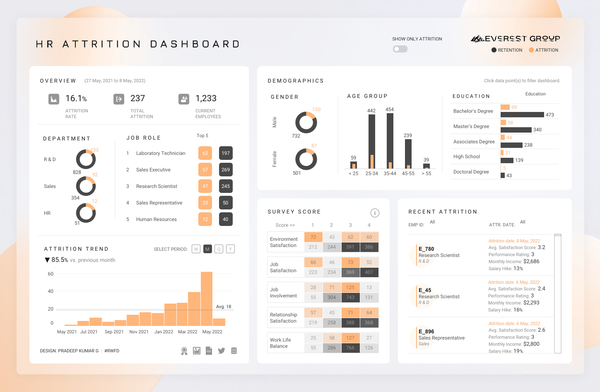
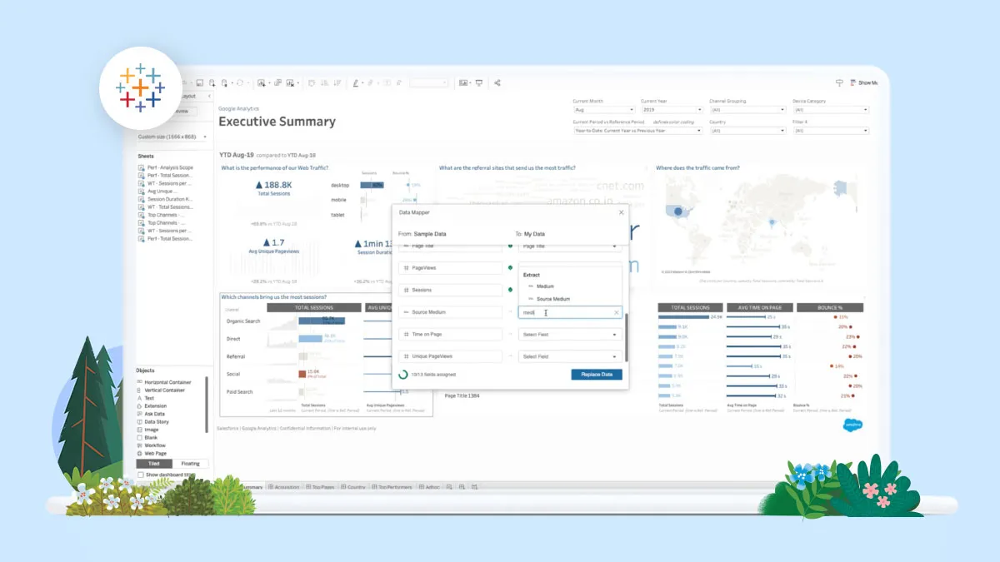

## Tableau

When it comes to elevating people with the power of data, only Tableau combines a laser focus on how people see and understand data with the kind of robust, scalable platform you need to run even the world’s largest organizations.

Powerful Analytics: Interactive, visual analysis lets you untangle thorny business questions and quickly get to the insights that propel your business forward.

Fast Adoption at Scale: Whether you’re building workbooks and dashboards, asking your own question or responsible for making data a more useful part of everyone’s workday, Tableau makes it easy to get value from data.

Fits your environment: We build Tableau with the flexibility to work within your enterprise architecture and data ecosystem. Work with your data your way.

Tableau helps people see and understand data. Millions of individuals and organizations worldwide use Tableau to gain powerful insights from their data with our industry-leading, business intelligence platform.

## To download Tableau from GitHub, simply follow these steps:

**1.** Click the download button on the Tableau GitHub page.

**2.** After clicking the button, you’ll see the download start in the top-right corner of your browser.

**3.** Once the download is complete, open the file to install Tableau on your computer.

**4.** Once installed, you will be able to edit your images with ease!

## Advantages of Tableau

1. **User-Friendly Interface**: Tableau has an intuitive and easy-to-use interface, making it accessible for beginners while offering advanced tools for professionals.

2. **Layer Support**: The software includes full support for layers, allowing for complex image compositions and easy editing of individual elements.

3. **Extensive Plugin Availability**: A wide range of plugins are available to extend functionality, from additional effects and tools to advanced features.

4. **Fast Performance**: Tableau is optimized for speed, ensuring smooth operation even on less powerful systems.

5. **Regular Updates**: The software is actively maintained with regular updates, providing users with new features, bug fixes, and improvements.

